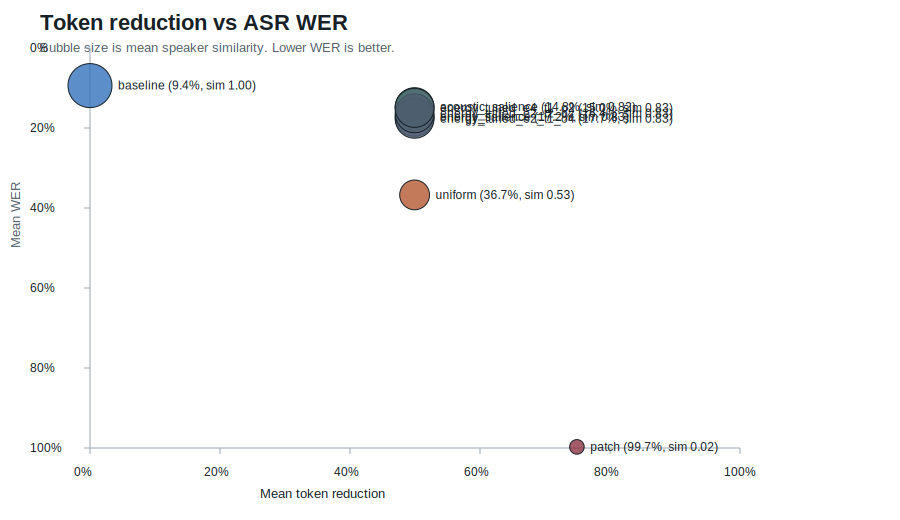

# AudioTokenLab Benchmark Report

## Summary

AudioTokenLab benchmarks how much EnCodec audio-token streams can be compressed before downstream speech utility breaks.

The current benchmark evaluates EnCodec 24 kHz reconstructions with `faster-whisper` and SpeechBrain ECAPA speaker embeddings on a 100-clip LibriSpeech `dev-clean` slice. The main result: simple salience-based sparse-frame retention gives the same roughly 50% token reduction as uniform frame dropping, but preserves both ASR and speaker similarity much better.

## Benchmark Setup

- Dataset: LibriSpeech `dev-clean`
- Source: OpenSLR SLR12, https://www.openslr.org/12/
- Clips: 100
- Speaker count: 40
- Chapter count: 97
- Audio format: mono 24 kHz WAV
- Tokenizer: EnCodec 24 kHz, 6 kbps target bandwidth
- Hardware: Modal L4 GPU
- ASR evaluator: `faster-whisper` `tiny.en`, CPU int8
- Speaker evaluator: SpeechBrain `speechbrain/spkrec-ecapa-voxceleb`
- Modal run: https://modal.com/apps/sourikadhikary/main/ap-cSbD1joos50zkMK4axaVX1
- Strategy set: tuned energy-salience ablation

Raw generated artifacts are intentionally ignored from git and live locally under:

```text
modal-runs/encodec_librispeech_asr/
```

The tracked machine-readable summary is:

```text
experiments/results/encodec_librispeech_asr_modal_2026-06-15.json
```

## Strategies

| Strategy | Description |
| --- | --- |
| `baseline` | No token compression. |
| `uniform` | Keep every second EnCodec frame. |
| `acoustic_salience` | In each 2-frame window, keep the RVQ frame with the strongest local token transition and repeat-fill the decode timeline. |
| `energy_salience` | In each 2-frame window, combine local token transition, frame energy, and onset-like energy changes before repeat-filling the decode timeline. |
| `energy_tuned_e4_t1_o2` | Tuned energy salience variant with stronger frame-energy weight. |
| `patch` | Average codec IDs across 4-frame windows. This is kept as a failure baseline because arithmetic over discrete codec IDs is not semantically meaningful. |

## Results



| Strategy | Token Reduction | Mean WER | WER 95% CI | Mean CER | Speaker Sim | KV Savings | Mean SNR |
| --- | ---: | ---: | ---: | ---: | ---: | ---: | ---: |
| `baseline` | 0.00% | 9.39% | 6.83%-12.40% | 4.94% | 1.000 | 0.00 MB | 7.05 dB |
| `uniform` | 49.94% | 36.72% | 31.09%-43.30% | 18.85% | 0.527 | 230.17 MB | -1.28 dB |
| `acoustic_salience` | 49.94% | 14.77% | 11.75%-18.13% | 8.00% | 0.824 | 230.17 MB | -0.11 dB |
| `energy_salience` | 49.94% | 17.23% | 13.86%-21.15% | 8.97% | 0.829 | 230.17 MB | -0.24 dB |
| `energy_tuned_e4_t1_o2` | 49.94% | 14.98% | 12.24%-18.20% | 7.61% | 0.831 | 230.17 MB | -0.23 dB |
| `patch` | 74.91% | 99.72% | 99.29%-100.00% | 97.85% | 0.019 | 345.27 MB | -6.42 dB |

## Interpretation

Uniform frame dropping is cheap, but it damages intelligibility and voice identity. On this 100-clip slice, it increases WER from 9.39% to 36.72% and drops speaker similarity to 0.527.

The salience baselines keep the same token budget as uniform dropping but preserve ASR and speaker similarity much better:

- `acoustic_salience`: 14.77% WER
- `energy_tuned_e4_t1_o2`: 14.98% WER
- `uniform`: 36.72% WER

The tuned energy variant does not beat acoustic salience on WER, but it has the best compressed-speaker similarity and the best CER among salience variants in this run. That makes it the more interesting starting point for future VAD-aware work.

The `patch` result is intentionally bad. It confirms that naive arithmetic over discrete codec IDs is a failure mode, not a viable compression method.

## Failure Cases

The generated dashboard includes worst-case transcript rows and audio controls:

```text
modal-runs/encodec_librispeech_asr/dashboard.html
```

Tracked shareable artifacts:

```text
experiments/results/encodec_librispeech_asr_100clip_summary_chart.svg
experiments/results/encodec_librispeech_asr_100clip_listening_examples.md
```

The main failure mode is not subtle: uniform frame dropping often turns words into plausible but wrong phrases. Patch averaging can collapse into empty or unrelated transcriptions. Salience methods still make word errors, especially on longer utterances, but they preserve enough local acoustic structure to stay far closer to the baseline.

## Launch Summary

Short version:

> I built AudioTokenLab, a benchmark for audio-token compression. On a 100-clip LibriSpeech EnCodec run, naive 2x frame dropping cut tokens by 50% but pushed WER to 36.7%. A simple salience policy kept the same 50% token reduction while cutting WER to 14.8% and preserving speaker similarity much better.

Numbers to mention:

- 100 real speech clips
- 800 reconstructed samples
- Modal L4 run
- EnCodec 24 kHz tokens
- `faster-whisper` WER/CER
- SpeechBrain ECAPA speaker similarity
- 49.96% token reduction
- 36.72% WER for uniform dropping vs 14.77% WER for acoustic salience
- best tuned energy variant: `energy_tuned_e4_t1_o2`

## Current Limitations

- 100 clips is a stronger benchmark than the smoke run, but still not a publication-grade estimate.
- `faster-whisper` `tiny.en` is a convenient evaluator, not an oracle for speech quality.
- Speaker similarity is measured with one pretrained embedding model; subjective voice quality and prosody are outside the v1 metric scope.
- The energy baseline uses frame energy as a lightweight VAD proxy, not a trained speech activity detector.
- Token compression is evaluated through reconstruction and ASR, not through a downstream audio-language model yet.

## Next Research Steps

1. Run across multiple speech datasets, not only LibriSpeech `dev-clean`.
2. Add a stronger VAD backend and compare against frame-energy heuristics.
3. Evaluate semantic audio tokens or learned token selectors instead of purely heuristic frame selection.
4. Add subjective listening ratings for the highest-impact failure cases.
5. Benchmark prefill/KV savings in an actual audio-token transformer once a target model is selected.
