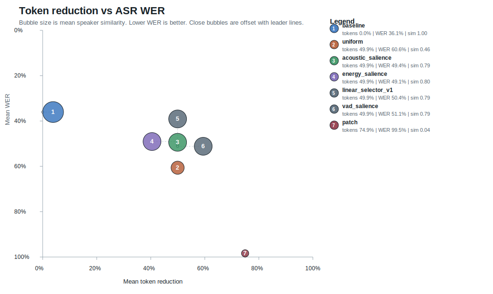

# AudioTokenLab Benchmark Report

## Summary

AudioTokenLab benchmarks how much EnCodec audio-token streams can be compressed before downstream speech utility breaks.

The current benchmark evaluates EnCodec 24 kHz reconstructions with `faster-whisper` and SpeechBrain ECAPA speaker embeddings on a 100-clip LibriSpeech `dev-clean` slice. The main result: simple salience-based sparse-frame retention gives the same roughly 50% token reduction as uniform frame dropping, but preserves both ASR and speaker similarity much better.

The repo also includes a broader 75-clip multi-corpus run across LibriSpeech, MInDS-14, and FLEURS, plus VAD/selector strategies, subjective listening-study sheets, and a serving-stack report for transformer prefill/KV-cache tradeoffs.

## Benchmark Setup

- Dataset: LibriSpeech `dev-clean`
- Source: OpenSLR SLR12, https://www.openslr.org/12/
- Clips: 100
- Speaker count: 40
- Chapter count: 97
- Audio format: mono 24 kHz WAV
- Tokenizer: EnCodec 24 kHz, 6 kbps target bandwidth
- Hardware: Modal L4 GPU
- ASR evaluator: `faster-whisper` `tiny.en`, CPU int8
- Speaker evaluator: SpeechBrain `speechbrain/spkrec-ecapa-voxceleb`
- Modal run: https://modal.com/apps/sourikadhikary/main/ap-cSbD1joos50zkMK4axaVX1
- Strategy set: tuned energy-salience ablation

Raw generated artifacts are intentionally ignored from git and live locally under:

```text
modal-runs/encodec_librispeech_asr/
```

The tracked machine-readable summary is:

```text
experiments/results/encodec_librispeech_asr_modal_2026-06-15.json
```

## Strategies

| Strategy | Description |
| --- | --- |
| `baseline` | No token compression. |
| `uniform` | Keep every second EnCodec frame. |
| `acoustic_salience` | In each 2-frame window, keep the RVQ frame with the strongest local token transition and repeat-fill the decode timeline. |
| `energy_salience` | In each 2-frame window, combine local token transition, frame energy, and onset-like energy changes before repeat-filling the decode timeline. |
| `energy_tuned_e4_t1_o2` | Tuned energy salience variant with stronger frame-energy weight. |
| `vad_salience` | Stronger speech-activity selector using normalized frame energy, short-run filtering, and hangover. Available in `--strategy-set extended`. |
| `linear_selector_v1` | Learned-selector integration point: a linear frame selector over energy, onset, transition, and speech-activity features. Available in `--strategy-set extended`. |
| `patch` | Average codec IDs across 4-frame windows. This is kept as a failure baseline because arithmetic over discrete codec IDs is not semantically meaningful. |

## Results


| Strategy | Token Reduction | Mean WER | WER 95% CI | Mean CER | Speaker Sim | KV Savings | Mean SNR |
| --- | ---: | ---: | ---: | ---: | ---: | ---: | ---: |
| `baseline` | 0.00% | 9.39% | 6.83%-12.40% | 4.94% | 1.000 | 0.00 MB | 7.05 dB |
| `uniform` | 49.94% | 36.72% | 31.09%-43.30% | 18.85% | 0.527 | 230.17 MB | -1.28 dB |
| `acoustic_salience` | 49.94% | 14.77% | 11.75%-18.13% | 8.00% | 0.824 | 230.17 MB | -0.11 dB |
| `energy_salience` | 49.94% | 17.23% | 13.86%-21.15% | 8.97% | 0.829 | 230.17 MB | -0.24 dB |
| `energy_tuned_e4_t1_o2` | 49.94% | 14.98% | 12.24%-18.20% | 7.61% | 0.831 | 230.17 MB | -0.23 dB |
| `patch` | 74.91% | 99.72% | 99.29%-100.00% | 97.85% | 0.019 | 345.27 MB | -6.42 dB |

## Interpretation

Uniform frame dropping is cheap, but it damages intelligibility and voice identity. On this 100-clip slice, it increases WER from 9.39% to 36.72% and drops speaker similarity to 0.527.

The salience baselines keep the same token budget as uniform dropping but preserve ASR and speaker similarity much better:

- `acoustic_salience`: 14.77% WER
- `energy_tuned_e4_t1_o2`: 14.98% WER
- `uniform`: 36.72% WER

The tuned energy variant does not beat acoustic salience on WER, but it has the best compressed-speaker similarity and the best CER among salience variants in this run. That makes it the more interesting starting point for future VAD-aware work.

The `patch` result is intentionally bad. It confirms that naive arithmetic over discrete codec IDs is a failure mode, not a viable compression method.

## Failure Cases

The generated dashboard includes worst-case transcript rows and audio controls:

```text
modal-runs/encodec_librispeech_asr/dashboard.html
```

Tracked shareable artifacts:

```text
experiments/results/encodec_librispeech_asr_100clip_summary_chart.svg
experiments/results/encodec_librispeech_asr_100clip_listening_examples.md
```

The main failure mode is not subtle: uniform frame dropping often turns words into plausible but wrong phrases. Patch averaging can collapse into empty or unrelated transcriptions. Salience methods still make word errors, especially on longer utterances, but they preserve enough local acoustic structure to stay far closer to the baseline.

## Broader-Speech Benchmark

The broader Modal run evaluates the extended strategy set across three sources:

- LibriSpeech `dev-clean`: 25 clips
- MInDS-14 `en-US`: 25 clips
- FLEURS `en_us`: 25 clips

Run details:

- Modal run: https://modal.com/apps/sourikadhikary/main/ap-GvQq49rJPkHf3SMC3joT5H
- Clips: 75
- Strategies: 7
- Reconstructed/evaluated samples: 525
- Strategy set: `extended`
- Serving microbenchmark: enabled



| Strategy | Token Reduction | Mean WER | Mean CER | Speaker Sim | KV Savings | Mean SNR |
| --- | ---: | ---: | ---: | ---: | ---: | ---: |
| `baseline` | 0.00% | 36.05% | 25.90% | 1.000 | 0.00 MB | 6.63 dB |
| `uniform` | 49.95% | 60.61% | 47.16% | 0.460 | 232.97 MB | -1.38 dB |
| `acoustic_salience` | 49.95% | 49.39% | 36.62% | 0.792 | 232.97 MB | -0.25 dB |
| `energy_salience` | 49.95% | 49.05% | 36.59% | 0.796 | 232.97 MB | -0.36 dB |
| `linear_selector_v1` | 49.95% | 50.38% | 36.98% | 0.792 | 232.97 MB | -0.32 dB |
| `vad_salience` | 49.95% | 51.15% | 38.35% | 0.792 | 232.97 MB | -0.22 dB |
| `patch` | 74.92% | 99.55% | 96.95% | 0.043 | 349.47 MB | -13.10 dB |

This run is deliberately harder than LibriSpeech `dev-clean`. `faster-whisper tiny.en` has a 36.05% baseline WER on the mixed corpus, so absolute WER should be read as evaluator stress. The same-budget comparison is still useful:

- `uniform`: 60.61% WER, 0.460 speaker similarity
- `energy_salience`: 49.05% WER, 0.796 speaker similarity
- `acoustic_salience`: 49.39% WER, 0.792 speaker similarity
- `linear_selector_v1`: 50.38% WER, 0.792 speaker similarity

At roughly 50% token reduction, `energy_salience` improves WER by 11.56 percentage points over uniform dropping and preserves much more speaker identity. The linear selector is close to the salience baselines but is still using hand-set weights, not trained weights.

## Trained Selector Artifact

The next selector artifact distills the 75-clip broader run into `trained_selector_v1`. It uses the evaluated ASR WER/CER, speaker similarity, and target token-reduction distance to assign credit across `acoustic_salience`, `energy_salience`, `vad_salience`, and `linear_selector_v1`, then blends their linear frame-selector templates.

Trained weights:

```json
{
  "energy": 1.272474,
  "onset": 1.318504,
  "transition": 1.271419,
  "speech_activity": 0.877787,
  "center": 0.034664
}
```

Training source:

```text
modal-runs/encodec_broader_speech_asr/
```

Tracked artifact:

```text
experiments/results/encodec_broader_speech_asr_modal_2026-06-16_trained_selector.json
```

Remote smoke validation for loading and running the trained selector: https://modal.com/apps/sourikadhikary/main/ap-zN30fQb7Yz3jV025WF9ssr

Held-out validation:

```text
Modal run:             ap-OaT2jqTQV5pGMO8mLoe16i
Fresh slice:           skip first 25 valid clips per source, then take 10 per source
Total clips:           30
Evaluated samples:     240
ASR evaluator:         faster-whisper small.en, CPU int8
Strategy set:          trained
```

| Strategy | Token Reduction | Mean WER | CER | Speaker Sim | KV Savings |
| --- | ---: | ---: | ---: | ---: | ---: |
| `baseline` | 0.00% | 38.31% | 32.40% | 1.000 | 0.00 MB |
| `uniform` | 49.95% | 49.93% | 43.54% | 0.466 | 228.25 MB |
| `energy_salience` | 49.95% | 48.91% | 42.07% | 0.817 | 228.25 MB |
| `linear_selector_v1` | 49.95% | 52.13% | 44.27% | 0.818 | 228.25 MB |
| `vad_salience` | 49.95% | 50.45% | 43.74% | 0.816 | 228.25 MB |
| `trained_selector_v1` | 49.95% | 48.10% | 41.80% | 0.821 | 228.25 MB |
| `patch` | 74.94% | 99.87% | 94.25% | 0.055 | 342.43 MB |

On the fresh held-out slice, `trained_selector_v1` is the best 50% reduction strategy by WER and speaker similarity. The run is intentionally compact to respect Modal credit constraints, so its confidence intervals are wide; it should be read as a validation checkpoint, not a final statistical claim.

Serving-stack report:

| Strategy | Mean Tokens | Prefill Work Ratio | Decode KV Read Reduction | CUDA Prefill |
| --- | ---: | ---: | ---: | ---: |
| `baseline` | 4974.2 | 1.000x | 0.00% | 4096 tokens, 10.56 ms |
| `energy_salience` | 2489.2 | 0.250x | 49.96% | 2264 tokens, 4.15 ms |
| `acoustic_salience` | 2489.2 | 0.250x | 49.96% | 2264 tokens, 4.08 ms |
| `linear_selector_v1` | 2489.2 | 0.250x | 49.96% | 2264 tokens, 5.26 ms |
| `patch` | 1246.5 | 0.063x | 74.94% | 1136 tokens, 2.01 ms |

The microbenchmark uses a reference PyTorch transformer layer on Modal L4. It caps representative token lengths at 4096, so the timings are serving-shape evidence, not a production voice-agent latency claim.

Tracked broader artifacts:

```text
experiments/results/encodec_broader_speech_asr_modal_2026-06-16_publication_summary.json
experiments/results/encodec_broader_speech_asr_modal_2026-06-16_summary_chart.svg
experiments/results/encodec_broader_speech_asr_modal_2026-06-16_serving_stack_report.md
experiments/results/encodec_broader_speech_asr_modal_2026-06-16_listening_study.csv
experiments/results/encodec_broader_speech_asr_modal_2026-06-16_trained_selector.json
experiments/results/encodec_broader_speech_asr_trained_heldout_small_en_2026-06-16_publication_summary.json
experiments/results/encodec_broader_speech_asr_trained_heldout_small_en_2026-06-16_asr_summary.json
experiments/results/encodec_broader_speech_asr_trained_heldout_small_en_2026-06-16_speaker_summary.json
experiments/results/encodec_broader_speech_asr_trained_heldout_small_en_2026-06-16_asr_evaluator.json
experiments/results/encodec_broader_speech_asr_trained_heldout_small_en_2026-06-16_summary_chart.svg
experiments/results/encodec_broader_speech_asr_trained_heldout_small_en_2026-06-16_serving_stack_report.md
experiments/results/encodec_broader_speech_asr_trained_heldout_small_en_2026-06-16_listening_study.csv
experiments/results/encodec_broader_speech_asr_trained_heldout_small_en_2026-06-16_listening_study_rating_summary.json
experiments/results/encodec_broader_speech_asr_trained_heldout_small_en_2026-06-16_listening_study_rating_summary.md
```

The earlier 3-clip smoke artifacts remain in `experiments/results/` as pipeline validation history.

## Next-Stage Workflows

Broader speech benchmark:

```bash
modal run modal_app.py --broader-speech-asr --max-clips-per-source 25 --strategy-set extended --serving-microbench
```

This combines LibriSpeech with public Hugging Face speech corpora such as MInDS-14 and FLEURS, subject to upstream access and license constraints. The corpus builder is source-configurable for TED-LIUM, Common Voice, VoxPopuli, or internal manifests when access is available. It emits the same ASR, speaker, publication, listening, and serving artifacts as the LibriSpeech path.

Small smoke variant:

```bash
modal run modal_app.py --broader-speech-asr --max-clips-per-source 1 --strategy-set extended
```

Fit selector weights:

```bash
PYTHONPATH=src python3 -m audiotokenlab train-selector \
  modal-runs/encodec_broader_speech_asr \
  --output experiments/results/encodec_broader_speech_asr_modal_2026-06-16_trained_selector.json
```

Evaluate trained selector:

```bash
modal run modal_app.py \
  --broader-speech-asr \
  --max-clips-per-source 10 \
  --skip-clips-per-source 25 \
  --strategy-set trained \
  --asr-model small.en \
  --serving-microbench
```

The serving report writes:

```text
serving_stack_report.json
serving_stack_report.md
```

It estimates transformer prefill attention-work ratio, decode KV-read reduction, and decode KV-read MB saved. With `--serving-microbench`, it also runs a reference PyTorch transformer layer on representative token lengths.

Subjective listening artifacts:

```text
listening_study.csv
listening_study.md
listening_study.json
```

The CSV is an anonymized rating sheet for MOS, intelligibility, speaker match, and artifact notes. It is generated from the existing ASR and speaker outputs, so it can be shared with listeners without changing the benchmark pipeline.

After ratings are filled in:

```bash
PYTHONPATH=src python3 -m audiotokenlab summarize-listening \
  modal-runs/encodec_broader_speech_asr/listening_study.csv
```

This writes:

```text
listening_study_rating_summary.json
listening_study_rating_summary.md
```

## Launch Summary

Short version:

> I built AudioTokenLab, a benchmark for audio-token compression. On a 100-clip LibriSpeech EnCodec run, naive 2x frame dropping cut tokens by 50% but pushed WER to 36.7%. A simple salience policy kept the same 50% token reduction while cutting WER to 14.8% and preserving speaker similarity much better.

Broader version:

> I extended it to a 75-clip mixed speech run across LibriSpeech, MInDS-14, and FLEURS. On this harder mixed-domain set, uniform 2x dropping hit 60.6% WER, while energy salience kept the same 50% token reduction at 49.1% WER and much higher speaker similarity.

Trained-selector version:

> I then distilled the mixed-domain benchmark into a learned selector and evaluated it on a fresh held-out slice with `faster-whisper small.en`. At the same 50% token reduction, `trained_selector_v1` reached 48.1% WER and 0.821 speaker similarity, beating uniform dropping and the hand-set salience baselines on this compact validation run.

Numbers to mention:

- 100 real speech clips
- 800 reconstructed samples
- 75 broader speech clips
- 525 broader reconstructed/evaluated samples
- 30 held-out trained-selector clips
- 240 held-out trained-selector samples
- Modal L4 run
- EnCodec 24 kHz tokens
- `faster-whisper` WER/CER
- SpeechBrain ECAPA speaker similarity
- 49.96% token reduction
- 36.72% WER for uniform dropping vs 14.77% WER for acoustic salience
- broader run: 60.61% WER for uniform dropping vs 49.05% WER for energy salience
- held-out run: 49.93% WER for uniform dropping vs 48.10% WER for `trained_selector_v1`
- broader serving report: 0.250x prefill attention-work ratio at roughly 50% token reduction
- best tuned energy variant: `energy_tuned_e4_t1_o2`

## Current Limitations

- 100 LibriSpeech clips, 75 broader clips, and 30 held-out selector clips are useful engineering benchmarks, but still not publication-grade estimates.
- The held-out trained-selector run is compact and credit-aware, so its confidence intervals are wide.
- `faster-whisper` evaluators are convenient regression tests, not oracles for speech quality.
- Mixed-domain baseline WER is high; broader absolute WER should be interpreted as evaluator stress.
- Speaker similarity is measured with one pretrained embedding model; subjective voice quality and prosody are outside the v1 metric scope.
- `vad_salience` is stronger than raw frame energy, but it is still deterministic signal processing rather than a trained VAD.
- `trained_selector_v1` is distilled from strategy-level benchmark outcomes; it is not yet trained from frame-level labels.
- Listening-study sheets and summarization are implemented, but human ratings are not included in the repo.
- The serving stack currently benchmarks transformer-shaped token workloads, not a production voice-agent model with live traffic.

## Next Research Steps

1. Collect subjective listening ratings for the generated study sheet.
2. Train a frame-level selector once frame labels or pairwise preference labels are available.
3. Add more licensed or internal speech corpora through the source-configurable corpus builder.
4. Swap the reference PyTorch transformer microbenchmark for a selected production-grade audio-token model.
